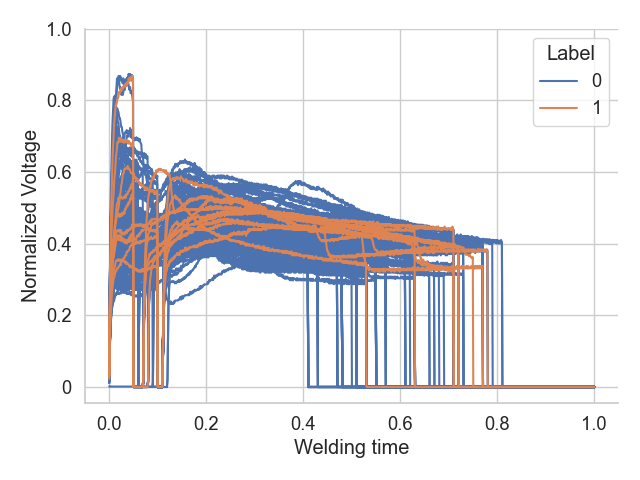

# Resistance Spot Welding Dataset
This repository contains a real-world dataset collected from a leading automotive industry, focused on the resistance spot welding process. The dataset includes 1,976 samples with labels indicating the presence of faulty welds (i.e., welds that have not been performed correctly).

The dataset features variables from the welding process, such as voltage, current, and force applied during the weld. Each sample is labeled with a binary value indicating whether the welding was correctly performed (0) or faulty (1). The label distribution is the following: 79 faulty and 1,897 non-faulty samples.

The repository includes the following files:
- labels.csv: Contains binary values where 1 indicates a faulty welding point.
- voltage.csv: Contains time-series data of the voltage applied during each welding operation.
- current.csv: Contains time-series data of the current applied during each welding operation.
- force.csv: Contains time-series data of the force applied during each welding operation.

All time-series data have been normalized to a range of [0,1] and zero-padded to 1,000 steps (the actual length varies between samples) as you can see in the figure below where we reported a few voltage time series, with different colours according to their label.

For every file, the first two columns represent the indexes of the sample: Car Body and Welding Spot numbers.
- There are 28 different car bodies
- There are 158 different welding points

Not all welding points have been collected for all car bodies.

Additionally, a third column representing the date of welding is present in all files. The welding have been performed within 13/06/2023 and 13/3/2024.

The remaining columns are named "X T-N", where X is replaced by the name of the variable and N represent the column time step, e.g., Voltage T-100.

